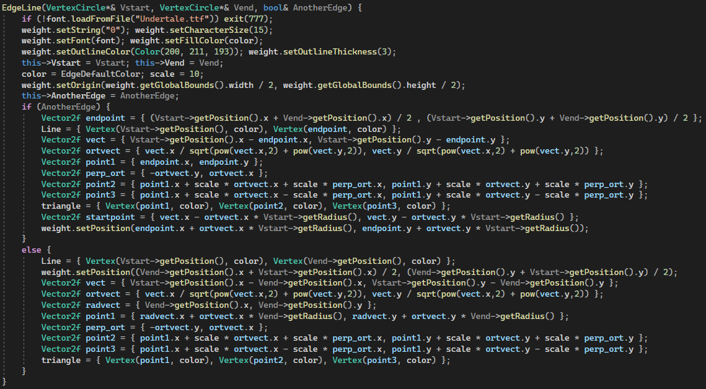
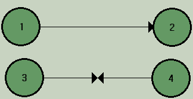

# Задача комивояжера
## Постановка задачи
Реализовать граф и решить для него задачу Коммивояжера методом ветвей и границ:
- Создать класс Graph;
- Модифицировать граф таким образом, чтобы для этого графа можно было решить задачу Коммивояжера;
- Проработать визуализирующую часть в программе средствами открытых кроссплатформенных графических библиотек в части построения графа.

## Анализ задачи
- Для решения всех поставленных задач необходимо реализовать отдельный параметризованный класс ```Graph```. Данный класс будет содержать матрицу смежности, реализованную как вектор векторов и вектор вершин графа:

- Для вектора вершин необходимо реализовать отдельный класс вершины графа:

- Добавление и удаление вершин происходит следующим образом:


- Добавление и удаление рёбер осуществляется с помощью работы с матрицей смежности:


- Для алгоритма решения задачи Коммивояжёра необходима функция по поиску соседей текущей вершины whatNeighbour, возвращающая вектор вершин:

- Функция нахождения задачи Коммивояжёра:


*****

Визуализация графа выполнена с помощью графической библиотеки SFML. Для реализации были написаны следующие классы:
1. VertexCircle - вершина графа, реализованная с помощью кольца. Сам класс наследуем от класса Drawable, определенного в библиотеке SFML. 


2. Класс EdgeLine - ребро, реализованное с помощью вершин Vertex и VertexCircle. Сам класс наследуем от класса Drawable, определенного в библиотеке SFML.




3. Класс Button - кнопка, реализованная с помощью прямоугольника. Имеет два режима - нажата или не нажата. Сам класс наследуем от класса Drawable, определенного в библиотеке SFML.


4. Класс Tip - вспомогательный класс, дающий пользователю подсказки о работе с интерфейсом программы, а также выдающий ответ на алгоритмы. Сам класс наследуем от класса Drawable, определенного в библиотеке SFML.


*****

  Сама программа является программой управляемой событиями. Она реагирует на следующие события:
1. Нажатие левой клавишей мыши по кнопкам и по вершинам;
2. Нажатие правой клавишей мыши:
- по вершинам - при нажатии появляется окно, в котором пользователь вводит новое имя для вершины;

- по рёбрам - при нажатии появляется окно, в котором пользователь вводит вес ребра;

3. Движение мыши содержащей вершину с зажатой ЛКМ;
4. “Освобождение” кнопки мыши;
5. Изменение размеров окна.

## Работа программы
- <скриншоты>

## Диаграмма классов


## Исходный код
Исходный код представлен в репозитории: https://github.com/BerdyshevDaniil/ARM_and_SalesmanProblem/tree/main/SalesmanProblem
