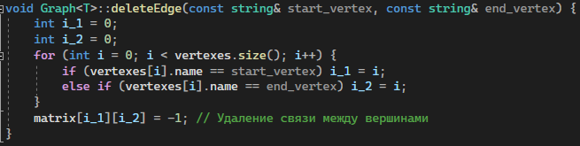

# Задача комивояжера
## Постановка задачи
Реализовать граф и решить для него задачу Коммивояжера методом ветвей и границ:
- Создать класс Graph;
- Модифицировать граф таким образом, чтобы для этого графа можно было решить задачу Коммивояжера;
- Проработать визуализирующую часть в программе средствами открытых кроссплатформенных графических библиотек в части построения графа.

## Анализ задачи
- Для решения всех поставленных задач необходимо реализовать отдельный параметризованный класс ```Graph```. Данный класс будет содержать матрицу смежности, реализованную как вектор векторов и вектор вершин графа:

- Для вектора вершин необходимо реализовать отдельный класс вершины графа:

- Добавление и удаление вершин происходит следующим образом:


- Добавление и удаление рёбер осуществляется с помощью работы с матрицей смежности:


- Для алгоритма решения задачи Коммивояжёра необходима функция по поиску соседей текущей вершины whatNeighbour, возвращающая вектор вершин:

- Функция нахождения задачи Коммивояжёра:


- Для решения задачи Коммивояжера использован метод ветвей и границ, который находит локально-оптимальное решение для данного графа. Если задачу невозможно решить для данного графа, то есть одна или несколько вершин не достижимы, то решения не будет и высветится подсказка, что необходимо отредактировать граф.
- Для визуализации использована библиотека ```SFML```. В проекте определены следующие классы: Button (класс кнопки), VertexCircle (класс вершины), EdgeLine (класс линии, связывающей вершины), а также вспомогательный класс Tip, служащий для вывода подсказок и решения задачи Коммивояжера пользователю. Данный класс позволяет не использовать консоль, что делает работу с программой более удобной для пользователя.

## Работа программы
- <скриншоты>

## Диаграмма классов


## Исходный код
Исходный код представлен в репозитории: https://github.com/BerdyshevDaniil/ARM_and_SalesmanProblem/tree/main/SalesmanProblem
