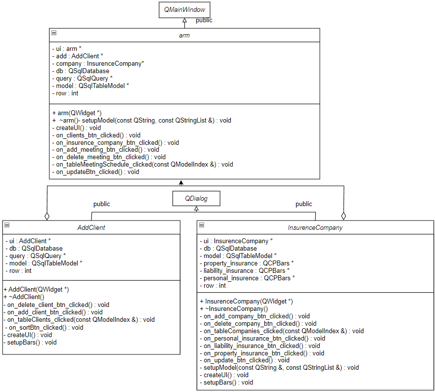

# Автоматизированное рабочее место специалиста
## Постановка задачи
Реализовать автоматизированное рабочее место специалиста (АРМ) - страхового агента.
Программа должна выполнять следующие функции:
- Управление событиями;
- Хранение и изменение нескольких списков, необходимых для работы;
- Представление графика для отображения процентов по заключению различных типов договоров и различных компаний.

## Анализ задачи
- Для управления событиями использован фреймворк QT. QT содержит библиотеку классов, которая включает в себя множество готовых решений для создания различных функциональных частей приложений, имеет визуализатор, который позволяет разработчикам легко создавать красивые и интуитивно понятные пользовательские интерфейсы, предлагает инструменты, которые сокращают время на разработку и тестирование приложений, позволяя быстрее и удобнее разрабатывать ПО.
- Для разработки приложения необходимо создать три таблицы: Clients (хранение информации о клиентах), MeetingSchedule (ведение расписания встреч), InsurenceCompanies (хранение информации о контрактах с различными страховыми компаними). Для данной задачи разделим эти таблицы по разным окнам.
- Для хранения вышеописаных списков использованна ```QSQLite``` база данных. В созданной базе данных создаются три таблицы соответственно. При выводе данных в приложение необходимо использовать ```SQL``` запросы.
- Для построения графика использовать базу данных, для этого написать ```SQL``` запрос, который будет выдавать данные для построения графика. Для визуализации графика использовалась библиотека ```QCustomPlot```. QCustomPlot - это библиотека для построения графиков в приложениях, написанных на C++ и использующих фреймворк QT. QCustomPlot поддерживает множество типов графиков, включая линейные, столбчатые, круговые, скрытые линии и многое другое. Библиотека также позволяет настраивать многие аспекты графиков, такие как цвет линий, начальные и конечные значения, пикселирование и т.д.

## Работа программы
### Таблица 1 - расписание встреч

### Демонстрация добавления

### Демонстрация удаления

### Демонстрация сортировки

### Таблица 2 - информация о клиентах 

### Таблица 3 - информация о контрактах со страховыми компаниями
Также, на данной вкладке находится диаграма. В зависимости от нажатой кнопки, показывается график по определённому типу страхования. Данная таблица позволяет понять, в какой компании выгоднее делать ту или иную страховку на данный момент.


#### Изменение графика с изменением таблицы


## Диаграмма классов


## Исходный код
Исходный код представлен в репозитории: https://github.com/BerdyshevDaniil/ARM_and_SalesmanProblem/tree/main/armtest
